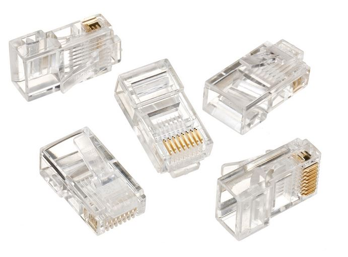
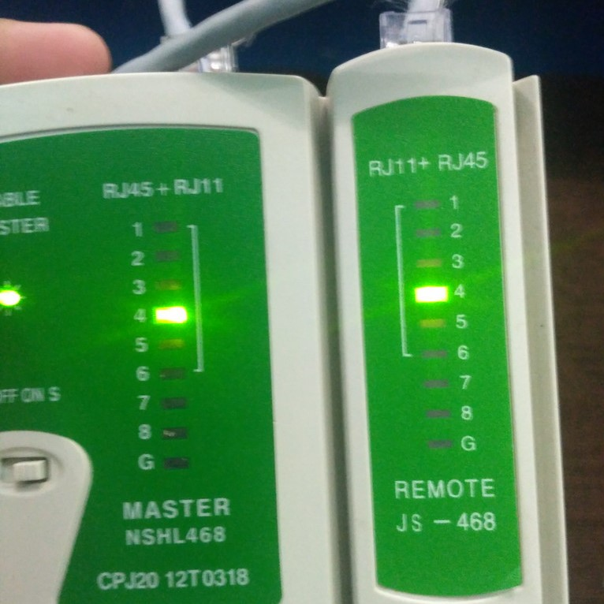
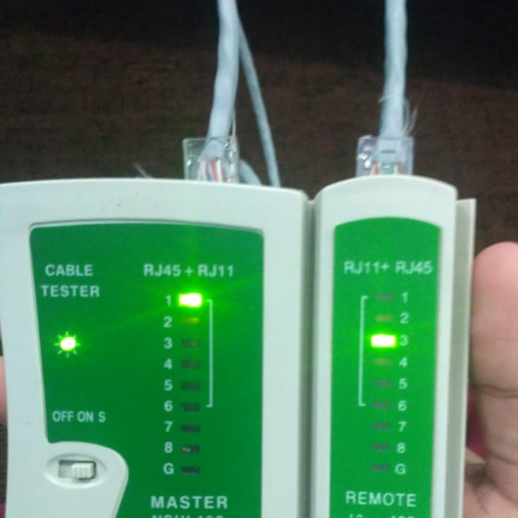

# Laporan Pratikum Konsep Jaringan

## 1. DASAR TEORI
<strong>Konsep Jaringan Komputer</strong> adalah sebuah aturan yang mendefinisikan beberapa fungsi yang ada dalam sebuah jaringan komputer, misalnya mengirim pesan, data, informasi, dan fungsi lain yang harus dipenuhi oleh sisi pengirim (transmitter) dan sisi penerima (receiver) agar komunikasi dapat berlangsung dengan benar. Dalam proses transaksi data tersebut, terdapat layer seperti OSI dan TCP/IP.

Berikut penjelasan tentang layer-layer OSI :
1. <strong>Application Layer</strong> : lapisan yang menjadi pusat (center) terjadinya suatu interaksi antara pengguna (end user) dengan aplikasi yang bekerja menggunakan fungsionalitas sebuah jaringan. Selain itu juga mempunyai fungsi untuk melakukan konfigurasi mengenai bagaimana cara aplikasi dapat bekerja menggunakan resource jaringan.
2. <strong>Presentation Layer</strong> : lapisan yang mempunyai fungsi untuk mentranslasikan format data yang akan ditransmisikan oleh aplikasi melalui jaringan, ke dalam format yang dapat ditransmisikan oleh sebuah jaringan.
3. <strong>Session Layer</strong> : lapisan yang berfungsi untuk mendefinisikan bagaimana sebuah koneksi dapat dibuat, dikelola, dan dikembangkan.
4. <strong>Transport Layer</strong> : lapisan yang mempunyai fungsi untuk memecah data menjadi paket-paket data, serta memberikan nomor urut untuk setiap paketnya.
5. <strong>Network Layer</strong> : lapisan yang bertujuan membuat header untuk paket yang berisi informasi IP (Internet Protocol), baik IP pengirim atau IP tujuan data.
6. <strong>Data-Link Layer</strong> : lapisan yang memiliki tugas untuk menentukan setiap bit data dikelompokkan menjadi format yang disebut dengan frame.
7. <strong>Physical Layer</strong> : lapisan yang berfungsi untuk mendefinisikan media transmisi jaringan, sinkronisasi bit, metode pensinyalan, serta membangun arsitektur jaringan seperti pengkabelan dan topologi jaringan.

### 1.1. MEDIA JARINGAN KOMPUTER
Beberapa media transmisi yang digunakan oleh Physical Layer, yaitu :
1. <strong>Radio Frekuensi</strong> atau biasanya disebut <strong>Wireless Network</strong> adalah bidang disiplin yang berkaitan dengan komunikasi antar sistem komputer tanpa menggunakan kabel. Jaringan nirkabel ini sering dipakai untuk jaringan komputer baik pada jarak yang dekat (beberapa meter, memakai alat/pemancar bluetooth) maupun pada jarak jauh (lewat satelit). 

2. <strong>Fiber Optik</strong> adalah saluran transmisi atau sejenis kabel yang terbuat dari kaca atau plastik yang sangat halus dan lebih kecil dari sehelai rambut, dan dapat digunakan untuk mentransmisikan sinyal cahaya dari suatu tempat ke tempat lain. Sumber cahaya yang digunakan biasanya adalah laser atau LED. Kabel ini berdiameter kurang lebih 120 mikrometer. 

3. <strong>Kabel Tembaga</strong> terbagi menjadi dua, yaitu UTP (Unshielded Twisted Pair) dan STP (Shielded Twisted Pair). Perbedaan dari keduanya adalah adanya pelindung dan tidak adanya pelindung pada bagian inti konduktornya. Kabel UTP terdiri dari 4 pasang kabel dengan jalinan yang berbeda-beda tiap incinya. Semakin rapat jalinan tersebut, tingkat transimisi dan harganya semakin tinggi. Kabel UTP ini menggunakan konektor RJ-45 yang biasa digunakan untuk Eternet, ISDN, atau sambungan telepon. Sedangkan, kabel STP terdiri dari sepasang kabel yang dilindungi oleh timah, dan masing-masing kabel tersebut dibungkus oleh pelindung. 

### 1.2. STANDAR KABEL UTP
Kabel UTP di kelompokan menggunakan istilah Category atau biasa kita menyebutnya CAT. Kabel UTP dikategorikan berdasarkan kualitas transmisi data yang tersedia. Semakin tinggi kategorinya maka semakin cepat transmisi data yang dilakukan. Di antara semua kategori kabel UTP, kabel CAT5e dan CAT5 merupakan yang paling populer yang banyak digunakan pada jaringan Ethernet.
- CAT1 (kabel dengan kualitas transmisi terendah yaitu sebesar 1 Mbps. Kabel dengan kategori ini hanya mendukung komunikasi suara analog saja sehingga kurang cocok untuk sistem modern saat ini).
- CAT2 (kabel yang memiliki kecepatan transmisi data hingga 4 Mbps. Kabel dengan kategori ini telah mendukung data dan suara digital).
- CAT3 (kabel yang memiliki kecepatan transmisi data hingga 10 Mbps dan mendukung komunikasi data dan suara digital. Bila ditinjau dari segi perkembangan teknologi Ethernet, kabel CAT3 memiliki kemampuan yang terendah, karena memang hanya mendukung jaringan 10BASE-T saja).
- CAT4 (kabel yang memiliki kecepatan transmisi data hingga 16 Mbps dan mendukung komunikasi data dan suara digital).
- CAT5 (kabel yang memiliki kecepatan transmisi data hingga 100 Mbps dan mendukung komunikasi data dan suara digital. Kabel jenis CAT5 ini juga dapat berjalan pada kecepatan transmisi data hingga 1Gbps tetapi dengan syarat panjang kabel harus lebih pendek dari 100 meter).
- CAT5e (kabel ini merupakan bentuk peningkatan dari kabel UTP CAT5 dengan kemampuan transmisi data hingga 1 Gbps atau pada kecepatan 10/100/1000Mbps. Kabel jenis ini direkomendasikan pada penggunaan jaringan Gigabit Ethernet, meskipun kabel UTP CAT 6 lebih direkomendasikan untuk kinerja yang maksimal).
- CAT6 (kabel yang memiliki kecepatan transmisi data hingga 10 Gbps dengan frekuensi komunikasi 250Mhz dan mendukung komunikasi data dan suara digital).
- CAT6a (kabel ini merupakan bentuk peningkatan dari kabel UTP CAT6 dengan frekuensi komunikasi yang lebih besar yaitu sebesar 500 Mhz).
- CAT7 (kabel yang memiliki kecepatan transmisi data hingga 10 Gbps dengan frekuensi komunikasi hingga 600 Mhz dan mendukung komunikasi data dan suara digital). 

### 1.3. KONEKSI DENGAN KABEL UTP
Fungsi kabel UTP berguna untuk mendukung konektivitas berbagai perangkat. UTP merupakan jenis kabel yang paling umum yang sering digunakan di dalam jaringan lokal (LAN). Sesuai dengan kebutuhannya, kabel LAN dibagi menjadi 2 jenis, yaitu :
1. Kabel Straight-Through
2. Kabel Cross-Over 

## 2. PEMBUATAN KABEL UTP
### 2.1. ALAT YANG DIPERSIAPKAN DAN KEGUNAANNYA
Untuk membuat kabel UTP, kita memerlukan beberapa alat dan bahan, yaitu :
1. <strong>Tang Crimping</strong> : tang yang berfungsi untuk memotong, mengupas dan menjepit kabel berjenis UTP (Unsielded Twisted Pair) dan STP (Sielded Twisted Pair) serta sekaligus dapat menghubungkan kabel ke konektor untuk jenis Rj11 dan Rj45.

2. <strong>Kabel UTP</strong> : salah satu perangkat keras komputer yang digunakan sebagai penghubung atau transmisi data pada sebuah jaringan. Fungsi kabel UTP dalam hal ini adalah untuk membatasi kecepatan akses internet komputer.

3. <strong>Konektor RJ 45</strong> : konektor kabel ethernet yang kebanyakan memiliki fungsi sebagai konektor pada topologi jaringan komputer LAN (Local Area Network) dan topologi jaringan lainnya.

### 2.2. LANGKAH PEMBUATAN KABEL TIPE STRAIGHT
Langkah-langkah untuk membuat kabel LAN dengan jenis Straight :
1. Kupas bagian ujung kabel UTP, kira-kira 2 cm.
2. Buka pilinan kabel, kemudian luruskan dan urutkan warna sesuai standart.
3. Setelah urutan sesuai standar, potong dan ratakan ujung kabel dengan tang crimping.
4. Masukkan kabel yang sudah lurus dan sejajar ke dalam konektor RJ-45, dan pastikan semua posisinya sudah benar.
5. Lakukan krimping dan tekan hingga semua pin ( kuningan) pada konektor RJ-45 sudah mengigit pada tiap kabel.

### 2.3. LANGKAH PEMBUATAN KABEL TIPE CROSS
Untuk membuat kabel Cross memiliki langkah yang hampir sama dengan kabel Straight, Perbedaannya hanya terletak pada urutan dari kedua ujung kabel. Berbeda dengan kabel straight yang memiliki urutan warna yang sama di kedua ujungnya, kabel cross memiliki urutan warna yang berbeda pada kedua ujung.

## 3. PENGETESAN KABEL UTP
### 3.1. ALAT PENGETESAN
<strong>LAN Tester</strong> adalah alat untuk mengecek koneksi sambungan kabel LAN RJ 45 dan RJ 11. Dilengkapi dengan lampu indikator, tombol pengatur kecepatan pengecekan, serta baterai dan kantong kecil.

### 3.2. CARA PENGETESAN KABEL
LAN Tester ini digunakan untuk mengecek kabel yang kita buat, jadi atau tidaknya baik itu kabel stright ataupun kabel cross, tapi saat sudah selesai crimping kabel RJ-45 tentu harus cek dengan LAN tester maka dari itu kita harus tahu urutan lampu nya yaitu sebagai berikut:
- Pengecekan kabel UTP tipe Straight-through 
Jika kalian mengecek kabel stright, maka lampu no 1 - 8 harus hidup semua secara berurutan, berikut penjelasannya.
| 1 -> 1 | 2 -> 2 | 3 -> 3 | 4 -> 4 | 5 -> 5 | 6 -> 6 | 7 -> 7 | 8 -> 8 |

- Pengecekan kabel UTP tipe Cross-over 
Untuk mengecek kabel cross, urutan lampu nya berbeda dengan urutan lampu kabel stright, maka susunan lampunya sebagai berikut : | 1 -> 3 | 2 -> 6 | 3 -> 1 | 4 -> 4 | 5 -> 5 | 6 -> 2 | 7 -> 7 | 8 -> 8 |
