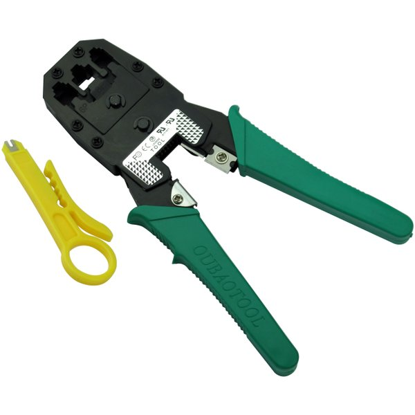
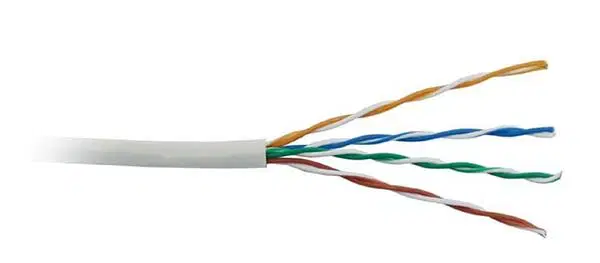
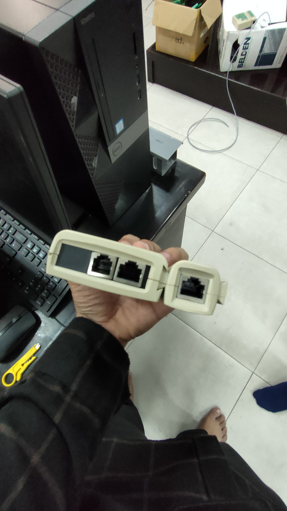
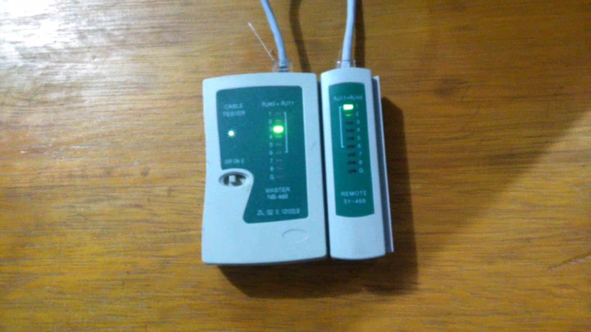

# Laporan Praktikum Konsep Jaringan

### Nama : Achmad Zahir Wajdi

### NRP : 3121600012

### Kelas : 2 D4 Teknik Informatika A

# 1. Dasar Teori

Media jaringan merupakan perangkat keras yang digunakan untuk menghubungkan 2 buah divaice atau lebih. Untuk membangun media jaringan membutuhkan minimal 2 komputer, Network Interface Card, alat pendukung seperti switch, hub, router, dll.

## 1.1. Media jaringan komputer

Komputer dapat terhubung dengan jaringan menggunakan media kabel utp, radio frekuensi, fiber optic. Media ini digunakan sebagai sarana penghubung 2 komputer atau lebih sehingga perangkat tersebut dapat terhubung.

## 1.2. Standar kabel UTP

kabel UTP mengikuti standar internasional yaitu aturan IEA/TIA 568A dan TIA/EIA 568B

Aturan IEA/TIA 568A

- Urutan ke 1 : Putih Hijau
- Urutan ke 2 : Hijau
- Urutan ke 3 : Putih Orange
- Urutan ke 4 : Biru
- Urutan ke 5 : Putih Biru
- Urutan ke 6 : Orange
- Urutan ke 7 : Putih Coklat
- Urutan ke 8 : Coklat

Aturan TIA/EIA 568B

- Urutan 1 : Putih Orange
- Urutan 2 : Orange
- Urutan 3 : Putih Hijau
- Urutan 4 : Biru
- Urutan 5 : Putih Biru
- Urutan 6 : Hijau
- Urutan 7 : Putih Coklat
- Urutan 8 : Coklat

## 1.3. Koneksi dengan kabel UTP

untuk mengkoneksikan kabel UTp ada 2 metode yaitu :

- a) Straight

  Kabel straight menggunakan standar yang sama antar ujung dengan ujung yang lain. Kabel straight digunakan untuk menguhubungkan hub ke router, menghubungkan switch ke router, menghubungkan komputer dengan switch.

  

* b) Crossover

  Kabel crossover menggunakan standar yang berbeda pada salah satu ujungnya, ujung ke-1 menggunakan standar IEA/TIA 568A sedangkan ujung kedua menggunakan standar IEA/TIA 568B. Kabel crossover digunkanan untuk mengghubungkan 2 buah komputer secara langsung, menghubungkan 2 bauh switch, menguhubkan 2 buah hub, menghubungkan switch dengan hub.

  

# 2. Pembuatan Kabel UTP

Cara pembuatan kabel UTP menggunakan metode crimping yaitu sebuah metode untuk menggabungkan kabel UTP dengan konektor RJ-45 supaya dapat membuat jaringan LAN.

## 2.1. Alat yang digunakan dan kegunaannya

Alat yang digunakan untuk membuat kabel UTP antara lain :

- Tang Crimping untuk memotong dan menjepit ujung konektor.

  

- Kabel UTP untuk menghubungkan jaringa internet.

  

- Konektor RJ-45 untuk dipasangkan pada ujung kabel UTP agar dapat dipasangkan pada port LAN.

  

- Cable Tester untuk melihat apakah kabel yang kita crimping sudah benar, apabila sudah benar maka lampu di Cable Tester akan menyala dengan otomatis

  

## 2.2. Langkah pembuatan kabel tipe straight

1. Kupas bagian ujung kabel UTP, kira-kira 2 cm.
2. Buka pilinan kabel, luruskan dan urutankan kabel sesuai standar.
3. Setelah urutannya sesuai standar, potong dan ratakan ujung kabel,
4. Masukan kabel yang sudah lurus dan sejajar tersebut ke dalam konektor RJ-45, dan
5. pastikan semua kabel posisinya sudah benar dengan posisi sebagai berikut:
   1. Orange Putih pada Pin 1.
   2. Orange pada Pin 2.
   3. Hijau Putih pada Pin 3.
   4. Biru pada Pin 4.
   5. Biru Putih pada Pin 5.
   6. Hijau pada Pin 6.
   7. Coklat Putih pada Pin 7.
   8. Coklat pada Pin 8.
6. Lakukan crimping menggunakan crimping tools.
7. Lakukan pengetesan kabel menggunakan LAN Tester dan pastikan lampu menyala sesuai dengan urutan kabel yang telah dibuat.

## 2.3. Langkah pembuatan kabel tipe crossover

1. Kupas bagian ujung kabel UTP, kira-kira 2 cm.
2. Buka pilinan kabel, luruskan dan urutankan kabel sesuai standar.
3. Setelah urutannya sesuai standar, potong dan ratakan ujung kabel,
4. Masukan kabel yang sudah lurus dan sejajar tersebut ke dalam konektor RJ-45, dan
5. pastikan ujung kabel pertama sama dengan kabel straight dengan posisi sebagai berikut:
   1. Orange Putih pada Pin 1.
   2. Orange pada Pin 2.
   3. Hijau Putih pada Pin 3.
   4. Biru pada Pin 4.
   5. Biru Putih pada Pin 5.
   6. Hijau pada Pin 6.
   7. Coklat Putih pada Pin 7.
   8. Coklat pada Pin 8.
6. pastikan ujung kabel kedua memiliki posisi yang berbeda dengan posisi kabel yang pertama, posisi kabel kedua sebagai berikut:
   1. Hijau Putih pada Pin 1.
   2. Hijau pada Pin 2.
   3. Orange Putih pada Pin 3.
   4. Biru pada Pin 4.
   5. Biru Putih pada Pin 5.
   6. Orange pada Pin 6.
   7. Coklat Putih pada Pin 7.
   8. Coklat pada Pin 8.
7. Lakukan crimping menggunakan crimping tools.
8. Lakukan pengetesan kabel menggunakan LAN Tester dan lampu 1, 2, 3 dan 6 akan saling bertukar.

# 3. Pengetesan Kabel UTP

Pengetesan diperlukan utuk mengetahui apakah kabel LAN yang telah kita buat berfungsi dapat berfungsi dengan baik.

## 3.1. Alat pengetesan

Alat yang digunakan untuk mengetes kabel LAN dinamakan LAN tester. LAN tester merupakan alat untuk mengetes kabel lan menggunakan indikator lampu.

## 3.2. Cara pengetesan kabel

1. Siapkan kabel LAN yang sudah dicrimping.
2. Hubungkan ujung kabel LAN pada port yang ada di LAN Tester.

   

3. Amati indikator yang menyala dengan urutan sebagai berikut :

   - a) Straight

     

     1. indikator lampu 1 akan menyala bersama dengan lampu 1
     2. indikator lampu 2 akan menyala bersama dengan lampu 2
     3. indikator lampu 3 akan menyala bersama dengan lampu 3
     4. indikator lampu 4 akan menyala bersama dengan lampu 4
     5. indikator lampu 5 akan menyala bersama dengan lampu 5
     6. indikator lampu 6 akan menyala bersama dengan lampu 6
     7. indikator lampu 7 akan menyala bersama dengan lampu 7
     8. indikator lampu 8 akan menyala bersama dengan lampu 8

   * b) Crossover

     

     1. indikator lampu 1 akan menyala bersama dengan lampu 3
     2. indikator lampu 2 akan menyala bersama dengan lampu 6
     3. indikator lampu 3 akan menyala bersama dengan lampu 1
     4. indikator lampu 4 akan menyala bersama dengan lampu 4
     5. indikator lampu 5 akan menyala bersama dengan lampu 5
     6. indikator lampu 6 akan menyala bersama dengan lampu 2
     7. indikator lampu 7 akan menyala bersama dengan lampu 7
     8. indikator lampu 8 akan menyala bersama dengan lampu 8
