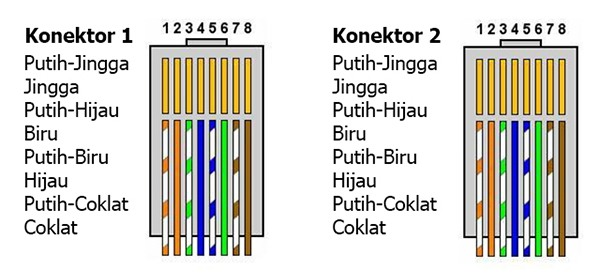
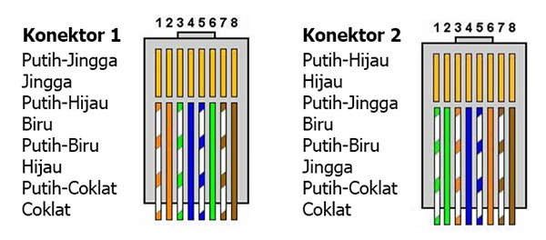
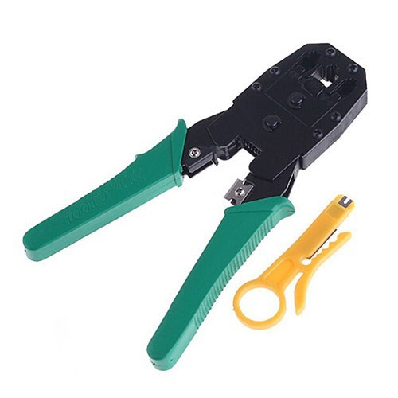

# Laporan Pratikum Konsep Jaringan 
## 1.0 Dasar Teori
Jaringan Komputer adalah sekumpulan komputer yang terhubung bersamman serta terdapat berbagi sumber daya yang dimilikinya; diantaranya ada printer, CDROM, pertukaran file dan komunikasi secara elektronik. Hubungan antar komputer ini bisa menggunakan media wired, Radio frekuensi, dan fiber optik. terdapat suatu istilah dalam jaringan komputer yaitu suatu himpunan interkoneksi sejumlah komputer yang terhubung dengan media transmisi wired (LAN) maupun wireless (WAN) yang mana hubungan tersebut saling bertukar informasi.
Dalam transaksi data terdapat layer yang disebut OSI layer dan TCP/IP.

 

OSI layer membagi menjadi 7 layer, setiap layer memiliki fungsi yang berbeda-beda. Berikut adalah fungsi dari setiap Layer OSI secara singkat :
1. Application layer (untuk menyediakan user interface yang mana terdapat protokol dalam lapisan ini yaitu HTTP, FTP, SMTP, dan NFS)
2. Presentation layer (menyajikan data dan menangani proses enkripsi data. serta protokol dalam layer ini adalah perangkat lunak redirektor seperti layanan workstation dan Nework shell / Remote Desktop Protocol)
3. Session layer (Memisahkan data dari berbagai aplikasi dalam artian bagaimana koneksi dapat dimulai, dipelihara, atau diakhiri. terdapat protocol pada layer ini salah satunya adalh NetBIOS)
4. Transport layer (digunakan untuk memecah data ke dalam kelompok data serta memberikan nomor urut pada kelompok data sehingga bisa disusun kembali ketika tujuannya sudah tercapai. Layer ini menyediakan transfer reliable/unreliable dilivery dan terdapat pengecheckan error koneksi sebelum transmisi data. serta menggunakan protokol UDP dan TCP)
5. Network layer (menyediakan logical addressing dan menentukan rute terbaik menuju tujuan pengiriman. layer ini menggunakan protocol IP)
6. Data-link layer (menyediakan akses ke media menggunakna MAC Address, melakukan error detection, dan juga melakukan decode dari data yang sudah dipecah)
7. Physical layer (mendefinisikan media transmisi jaringan, sinkronisasi bit, ethernet, dan penabelan. yang berkaitan dengan layer ini adalah wired, transceiver dan konektor)
### 1.1 Media Jaringan Komputer
Media merupakan salah satu faktor yang mendukung baik maupun buruknya suatu sistem jaringan tersebut. Pada media jaringan terdapat beberapa jenis yang biasanya digunakan seperti kabel tembaga (copper), serat optik (fiber optik), dan juga jaringan tanpa kabel (wireless).Semua media jaringan memiliki kelebihan dan kekurangannya masing-masing. Dalam media jaringan, kabel merupakan media yang sering digunakan untuk koneksi jaringan lokal atau lingkupan kecil. 
1. <strong>Kabel Tembaga (copper)</strong> Kabel LAN memiliki dua jenis yaitu STP (Shield Twisted Pair) dan UTP (Unsehield Twisted Pair). Media kabel STP banyak dipakai dalam kondisi khusus seperti pada kapal laut maupun pengeboran, karena kabel ini dibungkus oleh metallic foil sehingga pemasangannya lebih rumit daripada kabel UTP dan relative lebih mahal. namun, kabel ini bisa mengurangi gangguan elektronik dari luar kabel seperti EMI dan RFI. sedangkan media kabel UTP merupakan kabel dengan 4 pasang kawat yang masing-masing kawat dilapisi oleh insulator dan masing-masing kawat dipilin satu sama lain sehingga mengurangi degradasi sinya EMI dan RFI. UTP kurang tahan dengan interferensi elektromagnetik.
2. <strong>Fiber Optik</strong> adalah suatu teknologi yang canggih yang membuat pengguna memilih kabel ini sebagai pilihan utama jika menginginkan kualitas yang prima dalam komunikasi. Kabel fiber optik adalah kabel jaringan yang dapat mentransmisi cahaya yang memiliki jangkauan yang jauh dan tahan terhadap interferensi elektromagnetik serta dapat mengirim data dengan kecepatan tinggi.
3. <strong>Radio Frekuensi</strong> adalah suatu media jaringan komputer yang tidak menggunakan kabel atau wireless. jaringan nirkabel ini biasanya dipakai dalam jarak yang dekat maupun jarak yang jauh 
### 1.2 Standart Kabel UTP
Kabel UTP dikelompokkan menggunakan istilah category atau biasa disebut denga CAT. Kabel UTP dikategorikan berdasarkan kualitas transmisi data yang tersedia, semakin tinggi kategorinya semakin cepat transmisi datanya. Dari semua kategori yang ada, kabel CAT5 dam CAT5e merupakan kabel paling sering digunakan pada jaringan ethernet
- Berikut merupakan kategori pada kabel UTP
1. CAT1 (Kabel dengan kualitas transmisi terendah yaitu sebesar 1 Mbps dan hanya mendukung komunikasi suara analog)
2. CAT2 (Kabel ini memiliki kecepatan transmisi data hingga 4 Mbps dan sudah mendukung data dan suara digital)
3. CAT3 (Kabel ini memiliki kecepatan transmisi data hingga 10 Mbps dan sudah mendukung komunikasi data dan suara digital. Namun, jika dilihat dari teknologi ethernet, kabel ini memiliki kemampuan terendah karena hanya mendukung jaringan 10BASE-T)
4. CAT4 (Kabelini memiliki kecepatan transmisi data hingga 16 Mbps dan sudah mendukung komunikasi data dan suara digital)
5. CAT5 (Kabel ini memiliki kecepatan transmisi data hingga 100 Mbps dan sudah mendukung komunikasi data dan suara digital. kabel ini bisa berjalan pada kecepatan transmisi data hingga 1 Gbps namun panjang kabelnya harus kurang dari 100m)
6. CAT5e (kabel ini merupakan peningkatan dari kabel CAT5 dengan kemampuan transmisi data hingga 1 Gbps. kabel ini direkomendasikan pada penggunaan jaringan Gigabit Ethernet, meskipun kabel CAT6 lebih direkomendasikan)
7. CAT6 (Kabel ini memiliki kecepatan transmisi data hingga 10 Gbps dengan frekuensi komunikasi 250Mhz dan mendukung komunikasi data dan suara digital)
8. CAT6a (kabel ini merupakan bentuk peningkatan dari kabel CAT6 dengan frekuensi komunikasi lebih besar yautu sebesar 500Mhz)
9. CAT7 (kabel ini memiliki kecepatan transmisi data hingga 10 Gbps dengan frekuensi komnikasi hingga 600Mhz dan mendukung komunikasi data dan suara digital)
    

### 1.3 Koneksi dengan Kabel UTP
kabel UTP memiliki fungsi untuk mendukung konektivitas berbagai perangkat dan kabel UTP merupakan jenis kabel yang paling umum untuk pembuatan LAN. Terdapat 2 cara dalam menghubungkannya yang memiliki kegunaan yang berbeda
1. Kabel Straight-Through
   
   Berguna untuk menghubungkan dua perangkat yang berbeda (NIC dengan hub/switch)
   
2. Kabel Cross-Over
   
   berguna untuk menghubungkan dua perangkat yang sama (NIC dengan NIC) 
   
## 2.0 Pembuatan Kabel UTP
Pembuatan Kabel UTP merupakan kabel yang paling sering digunakan untuk menghubungkan antar komputer maupun komputer ke perangkat jaringan.

### 2.1 Alat yang Disiapkan dan Kegunaannya
Alat yang akan digunakan beserta kegunaannya : 
1. Tank Crimping adalah tank yang berfungsi untuk memotong, mengupas dan juga menjepit kabel UTP dan juga STP. serta, bisa digunakan untuk menghubungkan antara kabel dengan konektor
   
   
2. Kabel UTP adalah salah satu jenis kabeh LAN yang digunakan sebagai transmisi data pada sebuah jaringan.
   
3. Konektor RJ 45 adalah sebuah konektor kabel ethernet yang memiliki fungsi untuk dipasangkan pada ujung kabel UTP agar bisa digunakan pada port LAN.
   
4. LAN Tester adalah sebuah alat untuk menguji atau mengetest apakah kabel UTP yang telah dipasang konektor berfungsi dengan baik atau tidak
   
   
### 2.2 Langkah Pembuatan Kabel tipe Straigh
Langkah-langkah pembuatan kabel UTP tipe Straigh : 
1. Kupas bagian ujung kabel UTP, kurang lebih 1-2 cm.
2. buka pilinan kabel lalu luruskan dan urutkan sesuai warna standar (Bisa dilihat pada bab 1.3)
3. setelah sesuai urutan warna standar, potong sedikit ujung kabel hingga sama rata
4. Masukkan kabel yang sudah lurus dan sejajar ke dalam konektor RJ-45, dan pastikan semua posisi kabel sudah terkena ujung konektor RJ-45
5. Lakukan krimping dan tekan hingga semua kuningan pada RJ-45 sudah menggigit pada setiap kabel
   
### 2.3 Langkah Pembuatan Kabel tipe Cross
Langkah pembuatan kabel UTP bertipe Cross hampir sama dengan pembuatan kabel bertipe Straigh namun terdapat perbedaan pada posisi warna kabel (Susunan warna kabel bisa dilihat pada bab 1.3)

## 3.0 Pengetesan Kabel UTP
Langkah ini berguna untuk mengetahui apakah kabel LAN yang telah kita buat berfungsi dengan baik atau tidak
### 3.1 Alat Pengetesan
LAN Tester adalah alat untuk mengecheck apakah LAN berfungsi dengan baik yang dilengkapi oleh lampu indikator, tombol untuk mengatatur kecepatan pengecheckan dan juga baterai.

### 3.2 Cara Pengetesan
- Cara pengecheckan kabel UTP tipe Straigh
  
  ketika sudah memasukan konektor ke alat pengetestan dan sudah dimulai terdapat 8 lampu indikator dengan nomer 1-8. jika straigh maka lampu harus menyala secara berururtan: 1 -> 1, 2 -> 2, 3 -> 3, 4 -> 4, 5 -> 5, 6 -> 6, 7 -> 7, 8 -> 8.
- Cara pengecheckan kabel UTP tipe Cross-Over

    untuk mengecek kabel cross, urutan lampu indikator berbeda dengan yang bertipr Straigh. susunan lampunya yaitu: 1 -> 3, 2 -> 6, 3 -> 1, 4 -> 4, 5 -> 5, 6 -> 2, 7 -> 7, 8 -> 8.