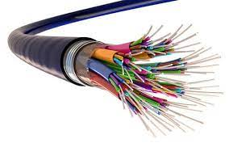

### 1 DASAR TEORI
Media jaringan adalah perangkat keras yang digunakan untuk membangun sebuah komputer baik itu perangkat keras maupun perangkat lunak. Disini untuk dapat membangun sebuah media jaringan diperlukan minimal dua buah komputer, kartu jaringan atau Network Interface Card dan perangkat keras jaringan lain seperti switch, hub, router, file server, repeater, bridge dan media transmisi.
### 1.1 MEDIA JARIANGAN KOMPUTER
  - KABEL UTP
  - RADIO FREQUENCY (RF)
  - FIBER OPTIC
   

